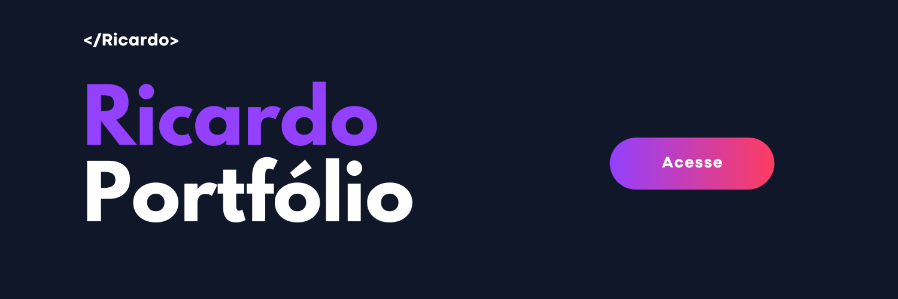

  

  <h1>Olá, eu sou José Ricardo Teixeira 👋</h1>
  <h3>Desenvolvedor Full Stack | Ciência de Dados</h3>

  

    Transformo dados e ideias em soluções digitais — de aplicações web a modelos de inteligência artificial.
  

  

    
    
    
  

---

## Sobre mim

Sou desenvolvedor em formação contínua, com base em **Análise e Desenvolvimento de Sistemas** e aprofundamento em **desenvolvimento Full Stack, Ciência de Dados e Inteligência Artificial**.

- 🎓 Graduado em Análise e Desenvolvimento de Sistemas pela Unifacid
- 📚 Pós-graduando em Ciência de Dados na Universidade de Fortaleza (UNIFOR)
- 💻 Aluno da Formação Full Stack da Digital College, pelo programa Geração Tech do IEL
- 📍 Fortaleza, Ceará
- 🎯 Foco atual: desenvolvimento web, dados e IA

## Tecnologias e ferramentas

### Desenvolvimento web

  

### Dados e back-end

  
  

### Versionamento

  

Além das ferramentas acima, estudo e aplico conceitos de **aprendizado de máquina**, **preparação de dados** e **análise de dados**.

## Projetos em destaque

### Fine-Tuning de LLM com GPT-2 e LoRA

Projeto acadêmico de aprendizado de máquina para adaptar um modelo GPT-2 ao português. O trabalho envolveu preparação e divisão dos dados, tokenização, treinamento, avaliação e análise dos resultados com LoRA.

`Python` `Machine Learning` `LoRA` `NLP`

[Conheça o projeto no portfólio →](https://rcardoo.github.io/portfolio/#projetos)

### TapCatGame — Jogo Interativo

Aplicação web em React com coleção de personagens, níveis de raridade, moedas e loja, criada para praticar desenvolvimento front-end e lógica de aplicação.

`React` `JavaScript` `Front-end`

[Acesse o projeto →](https://tapcat-v1.vercel.app/)

## Formação

- **Pós-graduação em Ciência de Dados** — Universidade de Fortaleza (UNIFOR) · Em andamento
- **Formação Full Stack** — Digital College · Geração Tech — IEL · Em andamento
- **Análise e Desenvolvimento de Sistemas** — Unifacid · Concluído em dezembro de 2025

## GitHub em números

  
  

## Vamos conversar?

Estou disponível para novos projetos, oportunidades e boas conversas sobre desenvolvimento web, dados e inteligência artificial.

📫 **[Portfólio](https://rcardoo.github.io/portfolio/) · [LinkedIn](https://www.linkedin.com/in/jos%C3%A9-ricardo-teixeira-980301196) · [E-mail](mailto:josericardo.barras18@gmail.com)**
